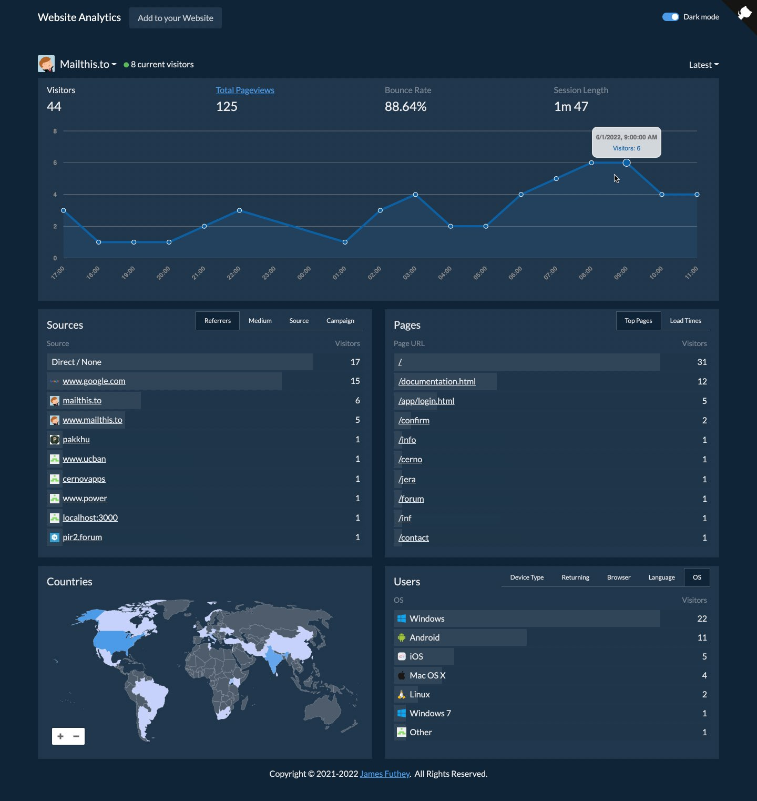

# SQLite Analytics

A simple analytics implementation that collects and serves data from a static CDN, using web workers, WASM, range requests, and some other fun tricks.



This is a ready-to-deploy package for [SQLite Analytics](https://analytics.servers.do/) is written in [Vue 3](https://v3.vuejs.org/) & [Express](https://expressjs.com/). The only dependency is persistent storage (for SQLite).

This project makes use of [sql.js-httpvfs](https://github.com/phiresky/sql.js-httpvfs) and sqlite for the database.

A static sqlite database is updated on an interval, and is directly accessed by the Vue app, using [sql.js-httpvfs](https://github.com/phiresky/sql.js-httpvfs). No backend server is required to query data, only to update it.

This allows you to do some interesting things, like set up a snowplow collector on a CDN, and run a batch job to update the sqlite3 database -- effectively and end-to-end serverless solution (depending on your ETL solution).

Because the entire database is available for the public to view, sensitive columns can be encrypted (optional) using the AES-SIV algorithm, to allow users with a private key to their own website to view the data, unencrypted.

A compact "seed" is used to generate the encryption and decryption key on the collection server, to allow stateless embedding of the collection script.

## Demo

https://analytics.servers.do/?host=analytics.servers.do&range=30

## Installation

`npm i` && `npm start` to run.

### Environment Variables

`.env` Recommended settings (optional):

```env
ENCSTR='pickareallylongrandomencryptionkeystring'
PORT=5000
```

### Persistent Storage

Persistent storage should be mounted to `/storage`. The database will be written to `/storage/analytics.sqlite3`.


---

## Frontend (Vue 3)

https://github.com/kidGodzilla/implausible-vue

## Previous Project

_This backend is not up-to-date and contains a couple of minor bugs. This version predates encryption._

https://github.com/kidGodzilla/unsimple-analytics

---

### Todos

- [x] Add dark mode
- [x] Display "current visitors" in the last 1 hour
- [x] Add deterministic encryption to the public database
- [x] Clean data in visits table older than ~32 days
- [x] Summarize data monthly to save space
- [x] Previous month (summary) view
- [x] Custom date ranges
- [x] Clickable charts
- [x] 12-month view
- [ ] Composite indexes
